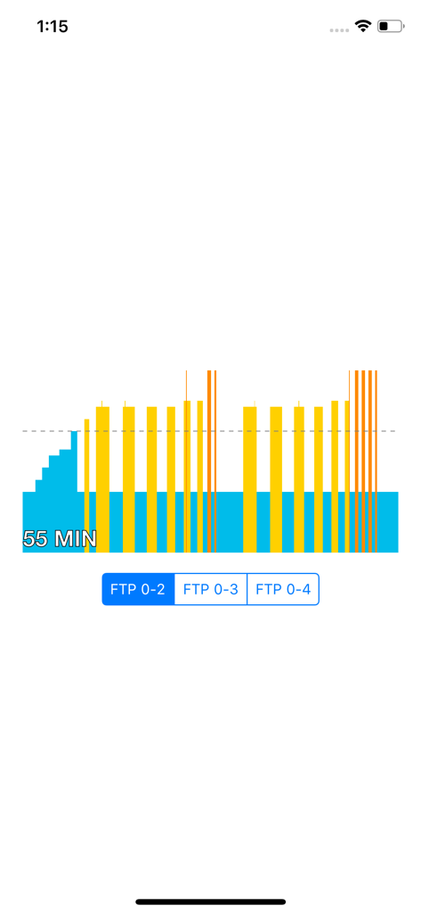
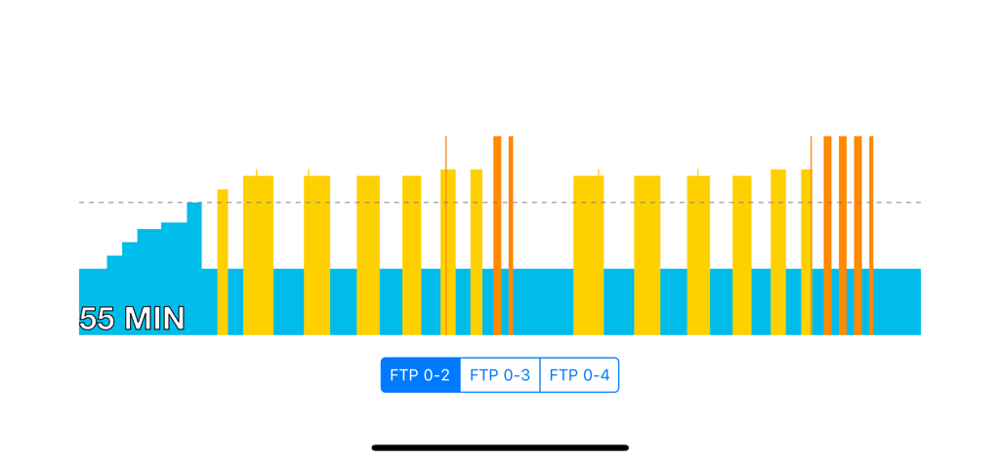

# DownwardSpiral

The DownwardSpiral project demonstrates the coding potential for Mike Silvers.  The guidelines for the project are as follows:
* Create an iOS app to display the workout chart for the DownwardSpiral.
* You may either use a Chart library or write your own.
* Use the supplied data for the chart.
* Make the chart display in some manner similar to the example chart.

## Installation

Download the repository. Open the ```DownwardSpiral.xcodeproj``` file in Xcode.  Review the code as appropriate.

## Usage
After opening the project in Xcode, run the tests.  In the ```DownwardSpiralTests.swift``` file, click next to ```class DownwardSpiralTests: XCTestCase``` to run all tests in order of top to bottom.

Once the tests have all passed, run the project in the iOS simulator.  You will be presented with a screen:



There is a light dashed line at the FTP 1.0 horizontal line.  This line is to give you reference to the FTP of 1.0.  In addition, each entry is color coded.  Blue is an FTP of 1.0 and below.  Yellow is an FTP above 1.0 and below or equal to 1.26.  Orange is an FTP above 1.26 and below or equal to 1.64.  Red is an FTP above 1.64.

There are three dataset options to test.  All colors are displayed according to the FTP of the individual entries.  The options are:
* FTP 0.0 thru FTP 2.0: Shows blue, yellow and orange.
* FTP 0.0 thru FTP 3.0: Shows blue, yellow, orange and red.
* FTP 0.0 thru FTP 4.0: Shows blue, yellow, orange and red.

Select any of the options and run accordingly.  Feel free to select all three options to test all functionality.

## License
There is no license associated with this project.  This project is purely for demonstration purposes.
